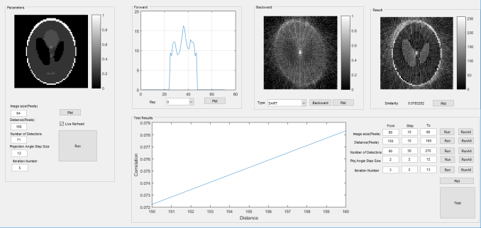

# Computerized Tomographic Imaging Simulation with Fan Beam Projection and Algebraic Reconstruction
This repo contains a Matlab simulation for the Computerized Tomography using x-rays. In this work four different algorithms are implemented; ART, SART, SIRT, M-SART (Modified SART). With the help of GUI parameters such as: image size, distance of ray projector, number of detectors and projection angle step size can be adjusted. Also tests can be ran for varying number of these parameters.

All formulations and algorithms are derived from: Avinash C. Kak and Malcolm Slaney, “Principles of Computerized Tomographic Imaging,” IEEE Press, New York, 1988

*GUI for the simulation*